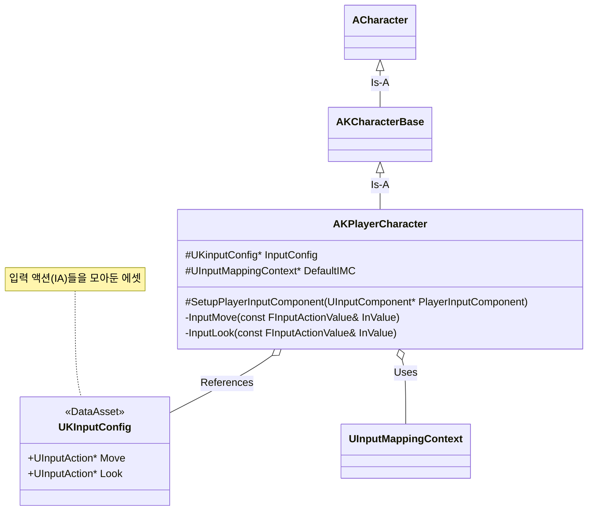

```mermaid

classDiagram
	ACharacter <|-- AKCharacterBase : Is-A
	AKCharacterBase <|-- AKPlayerCharacter : Is-A
	AKPlayerCharacter o-- UKInputConfig : References
	AKPlayerCharacter o-- UInputMappingContext : Uses
	
	class AKPlayerCharacter {
		#UKinputConfig* InputConfig
		#UInputMappingContext* DefaultIMC
		#SetupPlayerInputComponent(UInputComponent* PlayerInputComponent)
		-InputMove(const FInputActionValue& InValue)
		-InputLook(const FInputActionValue& InValue)
	}
	
	class UKInputConfig {
		<<DataAsset>>
		+UInputAction* Move
		+UInputAction* Look
	}
	
	note for UKInputConfig "입력 액션(IA)들을 모아둔 에셋"

```