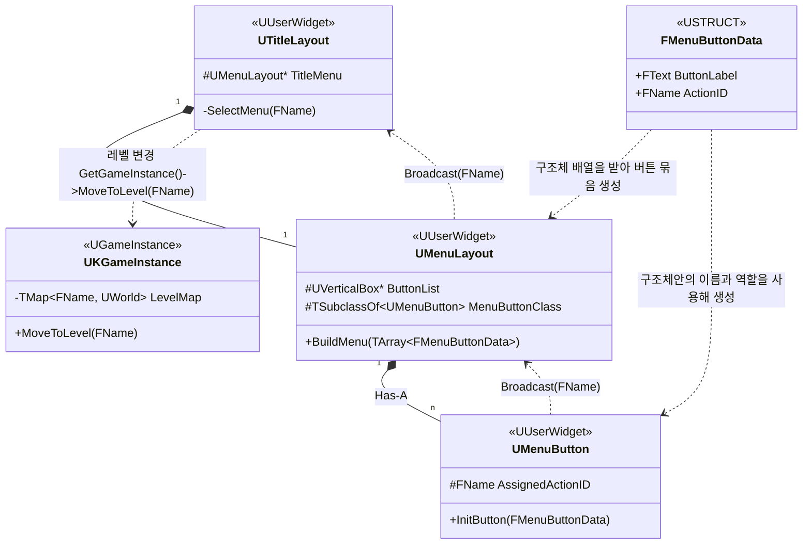

```mermaid
classDiagram
    direction TB
    
    class UKGameInstance {
        <<UGameInstance>>
        -TMap~FName, UWorld~ LevelMap
        +MoveToLevel(FName)
    }

    class UTitleLayout {
        <<UUserWidget>>
        #UMenuLayout* TitleMenu
        -SelectMenu(FName)
    }

    class UMenuLayout {
        <<UUserWidget>>
        #UVerticalBox* ButtonList
        #TSubclassOf~UMenuButton~ MenuButtonClass
        +BuildMenu(TArray~FMenuButtonData~)
    }

    class UMenuButton {
        <<UUserWidget>>
        #FName AssignedActionID
        +InitButton(FMenuButtonData)
    }

    class FMenuButtonData {
        <<USTRUCT>>
        +FText ButtonLabel
        +FName ActionID
    }

    %% 계층 관계
    UTitleLayout "1" *-- "1" UMenuLayout : Has-A
    UMenuLayout "1" *-- "n" UMenuButton : Has-A
    
    %% 데이터 흐름
    FMenuButtonData ..> UMenuLayout : 구조체 배열을 받아 버튼 묶음 생성
    FMenuButtonData ..> UMenuButton : 구조체안의 이름과 역할을 사용해 생성

    %% 이벤트 흐름 (델리게이트)
    UMenuButton ..> UMenuLayout : Broadcast(FName)
    UMenuLayout ..> UTitleLayout : Broadcast(FName)
    
    %% 기능 연결
    UTitleLayout ..> UKGameInstance : 레벨 변경 GetGameInstance()->MoveToLevel(FName)
```