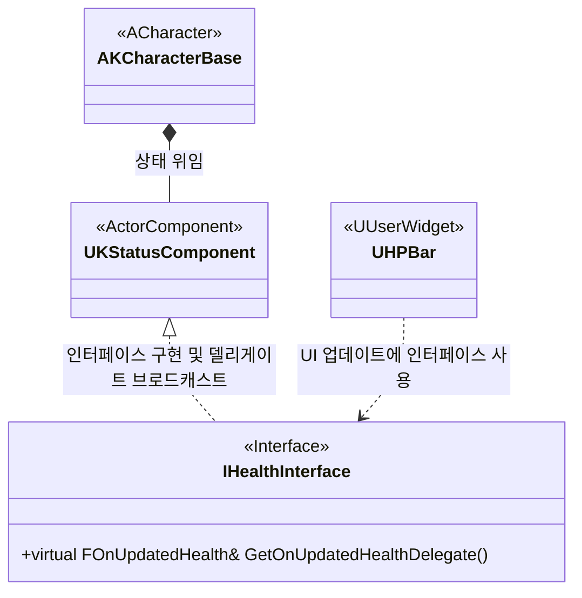

```mermaid
classDiagram
	direction TB
	AKCharacterBase *-- UKStatusComponent : 상태 위임
	UKStatusComponent <|.. IHealthInterface : 인터페이스 구현 및 델리게이트 브로드캐스트
	
	UHPBar ..> IHealthInterface : UI 업데이트에 인터페이스 사용
	
	class IHealthInterface {
		<<Interface>>
		+virtual FOnUpdatedHealth& GetOnUpdatedHealthDelegate()
	}
	class UHPBar {
		<<UUserWidget>>
	}
	class UKStatusComponent {
		<<ActorComponent>>
	}
	class AKCharacterBase {
		<<ACharacter>>
	}
```