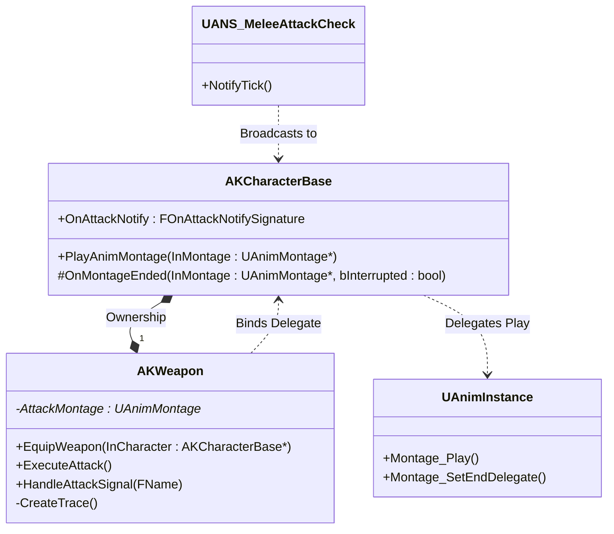

```mermaid
classDiagram
    class AKCharacterBase {
        +OnAttackNotify : FOnAttackNotifySignature
        +PlayAnimMontage(InMontage : UAnimMontage*)
        #OnMontageEnded(InMontage : UAnimMontage*, bInterrupted : bool)
    }

    class AKWeapon {
        -AttackMontage : UAnimMontage*
        +EquipWeapon(InCharacter : AKCharacterBase*)
        +ExecuteAttack()
        +HandleAttackSignal(FName)
        -CreateTrace()
    }

    class UANS_MeleeAttackCheck {
        +NotifyTick()
    }

    class UAnimInstance {
        +Montage_Play()
        +Montage_SetEndDelegate()
    }

    AKCharacterBase "1" *--* "1" AKWeapon : Ownership
    AKWeapon ..> AKCharacterBase : Binds Delegate
    UANS_MeleeAttackCheck ..> AKCharacterBase : Broadcasts to
    AKCharacterBase ..> UAnimInstance : Delegates Play
```