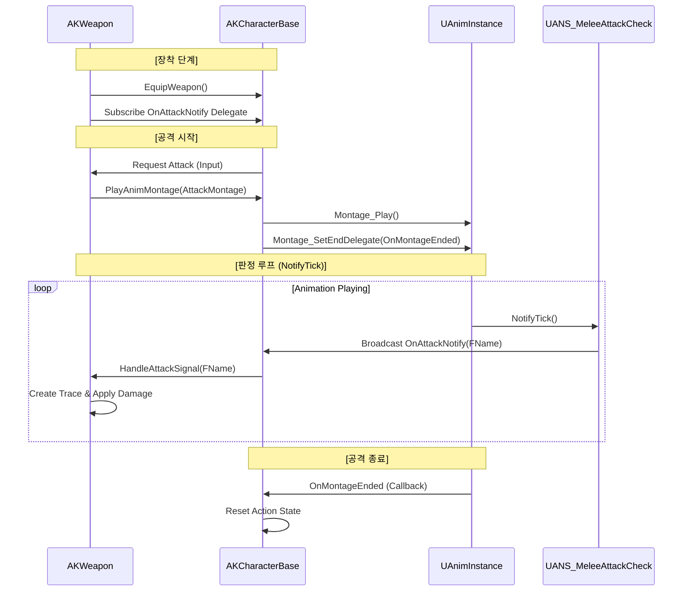

```mermaid
sequenceDiagram
    participant W as AKWeapon
    participant C as AKCharacterBase
    participant AI as UAnimInstance
    participant ANS as UANS_MeleeAttackCheck

    Note over W, C: [장착 단계]
    W->>C: EquipWeapon()
    W->>C: Subscribe OnAttackNotify Delegate

    Note over C, W: [공격 시작]
    C->>W: Request Attack (Input)
    W->>C: PlayAnimMontage(AttackMontage)
    C->>AI: Montage_Play()
    C->>AI: Montage_SetEndDelegate(OnMontageEnded)

    Note over AI, W: [판정 루프 (NotifyTick)]
    loop Animation Playing
        AI->>ANS: NotifyTick()
        ANS->>C: Broadcast OnAttackNotify(FName)
        C->>W: HandleAttackSignal(FName)
        W->>W: Create Trace & Apply Damage
    end

    Note over AI, C: [공격 종료]
    AI->>C: OnMontageEnded (Callback)
    C->>C: Reset Action State
```