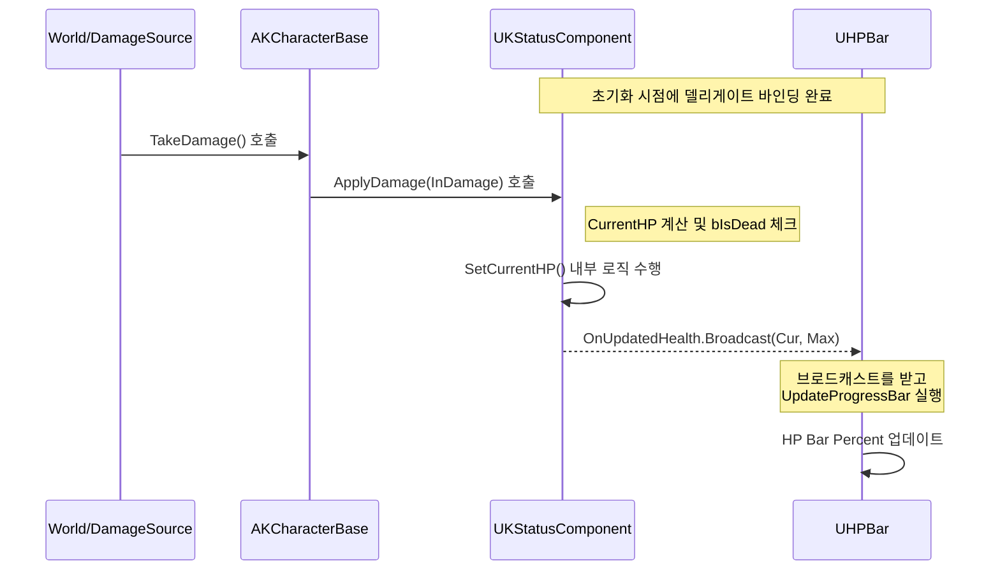

```mermaid
sequenceDiagram
    participant World as World/DamageSource
    participant Char as AKCharacterBase
    participant Comp as UKStatusComponent
    participant UI as UHPBar

    Note over UI, Comp: 초기화 시점에 델리게이트 바인딩 완료
    
    World->>Char: TakeDamage() 호출
    Char->>Comp: ApplyDamage(InDamage) 호출
    
    Note right of Comp: CurrentHP 계산 및 bIsDead 체크
    
    Comp->>Comp: SetCurrentHP() 내부 로직 수행
    Comp-->>UI: OnUpdatedHealth.Broadcast(Cur, Max)
    
    Note over UI: 브로드캐스트를 받고 <br/>UpdateProgressBar 실행
    UI->>UI: HP Bar Percent 업데이트
```